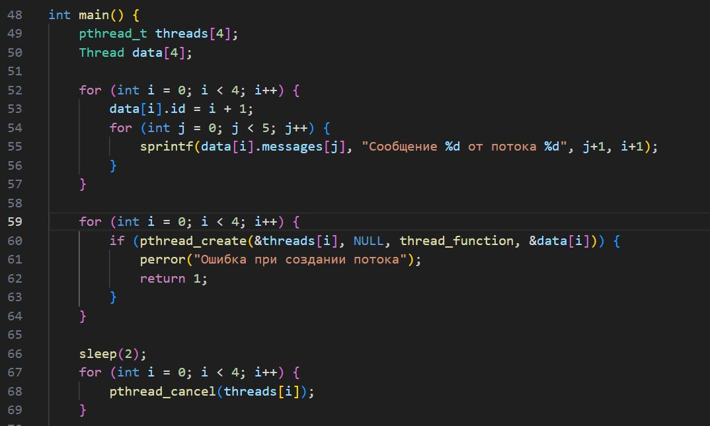
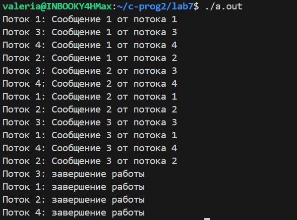

# 1.Создание потока
Написана программа, которая создает поток с помощью pthread_create(). Использованны атрибуты по умолчанию. Родительский и дочерний потоки выводят на экран по 5 строк текста.
 
 
# 2.Ожидание потока 
Модифицировано упр.1 так, что родительский поток выводит текст после завершения дочернего потока. 
 
 
# 3.Параметры потока
Модифицировано упр.2 так, что основной поток создает 4 потока, исполняющих одну и ту же функцию. Эта функция распечатывает последовательность текстовых строк, переданных как параметр. Каждый из созданных потоков распечатывает различные последовательности строк.
 
 
 
# 4.Завершение нити без ожидания
Добавлен сон с помощью sleep() в функцию потоков между выводами строк. Спустя две секунды после создания дочерних потоков основной поток прервает работу всех дочерних потоков с помощью pthread_cancel().
 
 
 
# 5.Обработать завершение потока
Модифицировано упр. 4 так, что дочерний поток перед завершением распечатывает сообщение об этом. Использован pthread_cleanup_push()
 
 
# 6.Реализовать простой Sleepsort
Реализован алгоритм сортировки Sleepsort с асимптотикой O(N) (по времени). Суть алгоритма: на вход подается массив, пусть будет не более 50 элементов и пусть будет состоять из целочисленных значений. Для каждого элемента массива создается отдельный поток, в который в качестве аргумента передается значение элемента. Сам поток должен уйти в сон с помощью sleep() или usleep() с параметром равным аргументу потока (значение элемента массива), а после вывести на экран значение.
 
 
 